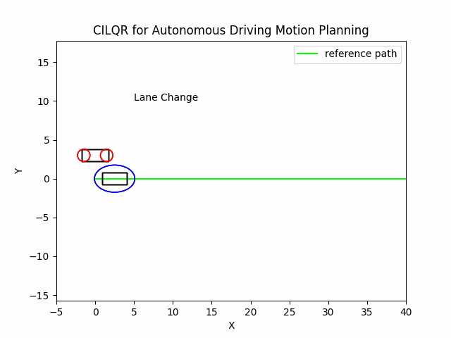

# CILQR for Autonomous Driving Motion Planning
This mini project implements a modified version of the Constrained iLQR for autonomous driving motion planning with soft constraints [1].

# Results of Example Settings
## Lane Change
    initial_condition:
      state: [0., 3., 5., 0.]
    obstacle:
      init_state: [2.5, 0., 3., 0.]

## Overtaking
    initial_condition:
      state: [0., 0., 5., 0.]
    
    obstacle:
      init_state: [5., 1.2, 3., 0.]

## Car Following
    initial_condition:
      state: [0., 0., 4., 0.]
    
    obstacle:
      init_state: [5., 0., 3., 0.]

# References
[1] Chen, J., Zhan, W., & Tomizuka, M. (2017, October). Constrained iterative lqr for on-road autonomous driving motion planning. In 2017 IEEE 20th International conference on intelligent transportation systems (ITSC) (pp. 1-7). IEEE.

